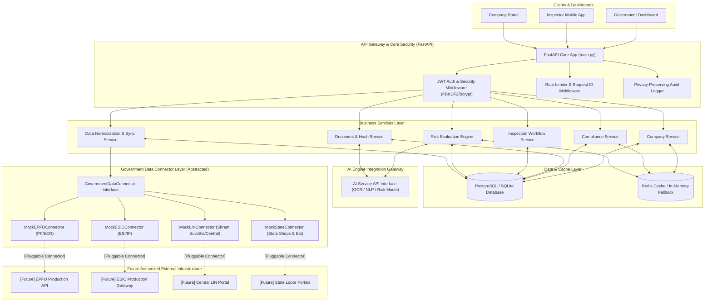

# SURAKSHIT SHRAM — Backend & Data Integration Layer

Official Backend & Data Integration sub-system for **SURAKSHIT SHRAM**, a government-oriented labor compliance management and enforcement platform.

This platform empowers labor departments, compliance officers, labor inspectors, and corporate establishments with automated compliance tracking, document verification hashing, risk evaluation, and multi-source government data synchronization.

---

## 1. Architecture Diagram



---

## 2. Technology Stack

* **Backend Framework**: Python 3.11+, FastAPI 0.110+
* **Data Validation & Settings**: Pydantic v2, Pydantic-Settings
* **ORM & Database**: SQLAlchemy 2.0+, PostgreSQL (Development fallback: SQLite)
* **Authentication**: JWT (JSON Web Tokens), Passlib (Bcrypt)
* **Caching Engine**: Redis 7+ (with seamless In-Memory Fallback)
* **Testing Framework**: Pytest, FastAPI TestClient, HTTPX
* **Containerization**: Docker, Docker Compose

---

## 3. Project Structure

```
backend/
├── app/
│   ├── main.py                   # FastAPI Application Entrypoint
│   ├── core/
│   │   ├── config.py             # Pydantic Settings & Env Config
│   │   ├── security.py           # Password Hashing & JWT Token utilities
│   │   ├── logging.py            # Structured Sanitizing Logger
│   │   └── exceptions.py         # Standardized Error Handling
│   │
│   ├── database/
│   │   ├── connection.py         # SQLAlchemy Engine & Session provider
│   │   └── base.py               # Declarative Base Model
│   │
│   ├── models/                   # SQLAlchemy ORM Models
│   │   ├── user.py               # User accounts & Role Enums
│   │   ├── company.py            # Company Profiles
│   │   ├── compliance.py         # Compliance Records (EPFO, ESIC, LIN, etc.)
│   │   ├── document.py           # Document Metadata & Hash References
│   │   ├── inspection.py         # Labor Inspections Workflow
│   │   ├── violation.py          # Recorded Compliance Violations
│   │   ├── risk_score.py         # Calculated Risk Scores & Metrics
│   │   ├── improvement_notice.py # Issued Legal Improvement Notices
│   │   ├── data_source.py        # Government Data Source Statuses
│   │   └── audit_log.py          # Privacy-Preserving Audit Trail
│   │
│   ├── schemas/                  # Pydantic Request/Response Schemas
│   │   ├── auth.py
│   │   ├── company.py
│   │   ├── compliance.py
│   │   ├── document.py
│   │   ├── inspection.py
│   │   ├── risk.py
│   │   └── sync.py
│   │
│   ├── api/                      # REST Endpoints
│   │   ├── auth.py               # /api/v1/auth
│   │   ├── companies.py          # /api/v1/companies
│   │   ├── compliance.py         # /api/v1/companies/{id}/compliance
│   │   ├── documents.py           # /api/v1/documents
│   │   ├── inspections.py        # /api/v1/inspections & violations
│   │   ├── risk.py               # /api/v1/companies/{id}/risk
│   │   ├── government_data.py    # /api/v1/sync & government-data
│   │   └── health.py             # /api/v1/health
│   │
│   ├── services/                 # Domain Business Logic
│   │   ├── company_service.py
│   │   ├── compliance_service.py
│   │   ├── document_service.py
│   │   ├── inspection_service.py
│   │   ├── risk_service.py
│   │   ├── sync_service.py       # Normalization & Idempotent Sync Engine
│   │   ├── cache_service.py      # Redis Cache with In-Memory Fallback
│   │   └── audit_service.py      # Security Audit Logging
│   │
│   ├── connectors/               # Government Connector Gateway
│   │   ├── base.py               # GovernmentDataConnector ABC
│   │   ├── epfo_mock.py          # EPFO Mock Connector
│   │   ├── esic_mock.py          # ESIC Mock Connector
│   │   ├── lin_mock.py           # Central LIN Mock Connector
│   │   └── state_mock.py         # State Labor Mock Connector
│   │
│   └── middleware/
│       ├── auth.py               # Role-based RBAC Dependencies
│       ├── request_id.py         # X-Request-ID Header Middleware
│       └── rate_limit.py         # Prototype Rate Limiter Middleware
│
├── tests/                        # Automated Pytest Suite
│   ├── unit/                     # Connector, Normalizer & Security Tests
│   └── api/                      # Auth, CRUD, Sync & Health Endpoint Tests
│
├── scripts/
│   └── seed_database.py          # Synthetic Data Generator (20 Companies)
│
├── .env.example
├── .gitignore
├── requirements.txt
├── Dockerfile
├── docker-compose.yml
└── README.md
```

---

## 4. Key Features & Specifications

### A. Role-Based Access Control (RBAC)
Supported User Roles:
* `COMPANY`: Manage company compliance records, upload documents, view risk status.
* `INSPECTOR`: Schedule inspections, log violations, issue improvement notices.
* `GOVERNMENT`: Access aggregate labor reports and government connector status.
* `ADMIN`: Full administrative control, trigger data sync, manage system entities.

### B. Document Verification & Hashing
* Uploaded compliance evidence files are validated for size (<10MB) and allowed extension.
* Calculates SHA-256 hash automatically for audit trail integrity.
* Storage abstraction allows local disk storage in prototype with zero friction cloud migration (S3 / GCS).

### C. Government Data Connector & Normalization Pipeline
Transforming disparate portal formats into standard unified domain models:
$$\text{External Response} \xrightarrow{\text{Connector}} \text{Raw Payload} \xrightarrow{\text{Normalizer}} \text{Common Schema} \xrightarrow{\text{Idempotent Update}} \text{Database}$$

Normalized Models:
* `CompanyGovernmentRecord`: Unified establishment details.
* `ComplianceGovernmentRecord`: Periodic return, payment date, receipt status.
* `WorkerContributionSummary`: Total covered workers, employer/employee share calculation.

### D. Privacy-Preserving Security Controls
* **Sanitized Logs**: Automatic regex filters redact passwords, JWT tokens, Aadhaar numbers, and PAN cards from server logs.
* **Audit Logging**: Structured audit trail tracking resource mutations (`AuditLog`).
* **Zero Real Personal Data**: Prototype operates strictly on synthetic sample records.

---

## 5. Quick Start Guide

### Local Setup (Virtual Environment)

1. **Clone repository and navigate to backend**:
   ```bash
   cd backend
   ```

2. **Create Python virtual environment**:
   ```bash
   python3 -m venv .venv
   source .venv/bin/activate
   ```

3. **Install dependencies**:
   ```bash
   pip install -r requirements.txt
   ```

4. **Initialize Environment Variables**:
   ```bash
   cp .env.example .env
   ```

5. **Seed Database with 20 Synthetic Companies**:
   ```bash
   python scripts/seed_database.py
   ```

6. **Run FastAPI Server**:
   ```bash
   uvicorn app.main:app --reload --port 8000
   ```
   * Interactive OpenAPI Documentation: [http://localhost:8000/docs](http://localhost:8000/docs)
   * Alternative ReDoc UI: [http://localhost:8000/redoc](http://localhost:8000/redoc)
   * Health Endpoint: [http://localhost:8000/api/v1/health](http://localhost:8000/api/v1/health)

---

## 6. Running Tests

Run the complete Pytest test suite:
```bash
pytest tests/ -v
```

---

## 7. Docker & Docker Compose Setup

Run full production stack (FastAPI Backend + PostgreSQL + Redis):

```bash
docker-compose up --build
```

---

## 8. Synthetic Seed Credentials

| Role | Username / Email | Password |
| :--- | :--- | :--- |
| **ADMIN** | `sysadmin` / `admin@surakshit.gov.in` | `<DEMO_ADMIN_PASSWORD>` |
| **INSPECTOR** | `inspector_sharma` / `inspector.sharma@labour.gov.in` | `<DEMO_INSPECTOR_PASSWORD>` |
| **GOVERNMENT** | `gov_nodal` / `nodal.officer@labour.gov.in` | `<DEMO_GOVERNMENT_PASSWORD>` |
| **COMPANY** | `bharat_textiles` / `compliance@bharattextiles.synth` | `<DEMO_COMPANY_PASSWORD>` |
